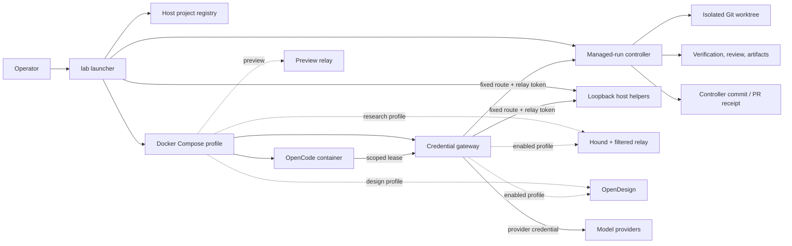

# Architecture

OpenCode Lab is a host-controlled harness around an untrusted coding-agent
process. The host launcher selects one project, creates project-scoped state
and short-lived authority, then starts a Docker-isolated OpenCode TUI. The
agent can edit the selected workspace but does not receive provider,
publishing, browser, or gateway-signing credentials.

This document describes the implemented architecture. Security assumptions and
residual risks are normative in the [threat model](threat-model.md).

## Component map

## Trust and authority

| Component                          | Trust level                  | Authority                                                                                                                    |
| ---------------------------------- | ---------------------------- | ---------------------------------------------------------------------------------------------------------------------------- |
| `lab` host launcher                | trusted operator code        | selects the canonical workspace, profiles, approval mode, leases, volumes, helpers, and updates                              |
| Managed-run controller             | trusted operator code        | creates worktrees, runs verification/review, records evidence, adopts an exact implementation, and invokes publishing relays |
| OpenCode and project code          | untrusted                    | selected workspace files, bounded tools, project-scoped configuration, and one signed capability lease                       |
| Agent gateway                      | privileged and narrow        | provider credentials plus an allowlist of model and fixed-purpose routes                                                     |
| Fixed-purpose relays               | privileged and narrow        | one protocol and operation set, one project/run lease, and one upstream credential class                                     |
| Optional Hound/OpenDesign services | untrusted external tooling   | only their declared research or design surface; disabled by default                                                          |
| Workflow packs                     | operator-approved extensions | declared, namespaced resources and bounded capabilities only                                                                 |

The gateway signing key remains on the host/gateway side. OpenCode receives a
lease, never the signing key. Provider and publishing credentials are injected
only into the process that owns the corresponding upstream route.

## Launch sequence

1. `lab open [path]` resolves the canonical path and stable project ID.
2. The launcher validates Node, Docker, Git, project contract, configured packs,
   preview ports, and managed-run eligibility.
3. It enforces one foreground interactive workspace. Background managed runs do
   not take foreground ownership.
4. It materializes generic and enabled-pack configuration into a fresh,
   project-scoped host directory.
5. It selects the default, research, design, or combined Compose profile.
6. It starts/reuses helpers only when their project ID and workspace hash match.
7. It creates a launch/session identity and a signed short-lived lease.
8. It starts OpenCode with the selected workspace mounted read/write and
   credential-class project paths masked.
9. OpenCode calls models and privileged tools only through the gateway and
   fixed-purpose relays.
10. The launcher unregisters the exact foreground launch on clean exit and
    leaves project-scoped persistent state available for resume.

## Network data flow

OpenCode has no general outbound network path. Traffic is split by purpose:

| Purpose                      | Path                                                                          |
| ---------------------------- | ----------------------------------------------------------------------------- |
| Workers AI, OpenAI, Vertex   | OpenCode → credential gateway → fixed provider endpoint                       |
| Public-web research          | OpenCode → gateway/Hound relay → filtered Hound service                       |
| Design                       | OpenCode → gateway → OpenDesign fixed API paths                               |
| Browser verification/control | OpenCode → gateway → authenticated loopback host relay                        |
| GitHub publication           | OpenCode/controller → gateway → GitHub publishing relay                       |
| Notion publication           | OpenCode/controller → gateway → restricted Notion sidecar                     |
| Artifact download            | OpenCode → gateway → HTTPS allowlisted hostname → bounded staging result      |
| Local app preview            | project server `:3000`/`:3001` → preview relay → Mac `127.0.0.1:3100`/`:3101` |

Every privileged gateway request must satisfy both configured route policy and
the current lease scope. The gateway blocks unknown methods, paths, models,
actions, and missing configuration. Artifact downloads additionally reject
HTTP, credentials in URLs, private/metadata addresses, DNS rebinding,
disallowed redirects, traversal, invalid content types, oversized bodies, and
checksum mismatches.

See [Gateway and capability protocol](gateway-protocol.md) for the route and
claim reference.

## Persistent state ownership

Runtime files are host-owned and are not written into selected repositories.

| State                                | macOS default                                        | Notes                                                                            |
| ------------------------------------ | ---------------------------------------------------- | -------------------------------------------------------------------------------- |
| Lab state                            | `~/Library/Application Support/OpenCode Lab/state`   | project registry, project state, runs, releases, updates                         |
| Lab config                           | `~/Library/Application Support/OpenCode Lab/config`  | preferences and host-owned approval selection                                    |
| Backups                              | `~/Library/Application Support/OpenCode Lab/backups` | update/rollback state backups                                                    |
| Project-local compatibility excludes | `<repo>/.git/info/exclude`                           | ignores unavoidable local runtime paths without editing `.gitignore`             |
| Docker volumes                       | `opencode-lab-<project-id>-*`                        | sessions, cache, runtime config, and optional-service state scoped by project ID |

On non-macOS systems the defaults follow XDG state/config directories.
`OPENCODE_LAB_STATE_ROOT` and `OPENCODE_LAB_CONFIG_ROOT` may override them with
absolute host paths. Project code cannot write the host registry, preferences,
approval mode, gateway signer, or another project's volumes.

## Project configuration

Configuration has three layers, from least to most trusted:

1. **Project contract** — optional tracked
   `.opencode-lab/project.json`; bounded install, verify, development, preview,
   artifact, risk, and pack metadata. It cannot grant authority.
2. **Project-local OpenCode resources** — `.opencode` agents/skills used inside
   the selected repository and still subject to Lab policy.
3. **Host configuration and packs** — ignored `opencode.env`, approval
   preferences, credentials, and operator-approved pack roots.

The launcher validates and materializes only declared pack resources. Duplicate
IDs, namespaces, targets, services, contracts, model aliases, and artifact
names fail closed. See [Project contract](project-contract.md) and
[External workflow packs](packs.md).

## Managed-run architecture

Interactive edits and managed runs are distinct:

- Interactive OpenCode writes the selected workspace directly under the chosen
  approval mode.
- `/ship`, `/research`, `/parallel`, background jobs, and fleet jobs use the
  durable run service and isolated Git worktrees.
- A managed implementation must emit the exact `quality-result/v1` result.
- The controller commits only declared changed files, then binds verification,
  independent review, evidence, adoption, and publishing to that commit SHA.
- Git recovery refs preserve unpublished verified heads.
- External actions use idempotency receipts so restart does not duplicate a PR
  or adoption.

See [Managed runs](managed-runs.md) for states and operator actions.

## Update and strict-execution boundaries

`lab update` stages candidate images and code, runs compatibility checks, backs
up state, and activates an atomic release pointer. `lab rollback` restores the
previous staged release; it does not rewrite a selected project.

`lab --strict` uses Docker Sandboxes as a separate clone-isolated backend. The
host checkout is not mounted read/write. Results cross back only as a signed,
bounded export and require explicit `lab strict adopt ... --approve`. See
[Compatibility](compatibility.md) and [Strict mode](strict-mode.md).

## Extension points

Supported extensions are deliberately narrow:

- project contract schema v1;
- workflow pack schemas v1/v2;
- Node, Python, and monorepo execution adapters;
- project-local OpenCode agents and skills;
- generic quality contracts and artifact declarations;
- optional fixed-purpose research/design/publishing services.

Adding a new privileged route, credential class, executable service, or
approval bypass is an architecture and security-boundary change. It requires an
RFC, threat-model update, protocol documentation, and boundary-crossing tests.
