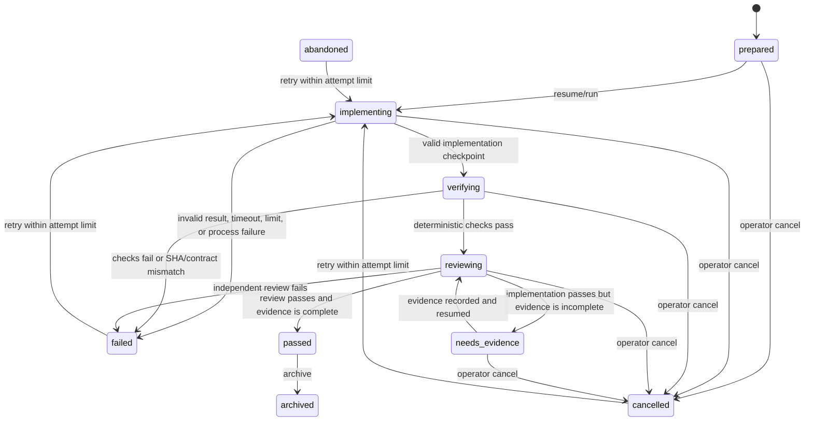

# Managed runs

Managed runs turn an agent request into an isolated, recoverable, evidence-bound
change. `/ship`, `/research`, `/parallel`, detached background jobs, and fleet
jobs share one durable run service. The controller—not the model—owns
worktrees, commits, verification, review, adoption, and publication receipts.

Use `/runs` or `Ctrl+Shift+R` for normal operation. The controller CLI exists
for automation and debugging; see [CLI reference](cli-reference.md).

## Why managed runs exist

An ordinary interactive session can edit the mounted project directly. A
managed run adds stronger guarantees:

- one isolated Git worktree and branch per implementation;
- explicit task, agent, model route, limits, and quality contract;
- an exact machine-validated implementation result;
- a controller-owned commit containing only declared changed files;
- deterministic verification and independent read-only review bound to the
  implementation SHA;
- durable checkpoints, trace, approvals, attempts, artifacts, notifications,
  and immutable outcomes;
- Git recovery refs for unpublished work;
- idempotent adoption and pull-request preparation.

## Lifecycle



The durable service also represents wrapper states used by queued/fleet/legacy
jobs: `queued`, `running`, and `completed`. The controller's quality states are
`prepared`, `implementing`, `verifying`, `reviewing`, `needs_evidence`,
`passed`, `failed`, `cancelled`, `abandoned`, and `archived`.

Terminal states are `passed`, `failed`, `cancelled`, `abandoned`, `archived`,
and legacy `completed`. A terminal record may be archived or cleaned only when
its safety conditions are satisfied.

## Preparation and isolation

Preparation requires a Git repository, a resolvable base SHA, a supported
execution adapter, and a quality contract. Unless explicitly allowed for a
controlled migration, the source must be clean. The controller creates:

- run ID and project ID;
- isolated branch and worktree;
- task/agent/model route;
- base SHA and declared verification commands;
- normalized phase limits;
- controller record and durable service record;
- an idempotency receipt when an idempotency key is supplied.

Parallel members receive independent worktrees and run records. A parent keeps
their IDs and may synthesize only when all required members passed. It does not
silently merge conflicting work or treat a failed/cancelled member as ready.

## Agent result protocol

The last assistant implementation result must be an exact object using
`quality-result/v1`:

```json
{
  "protocol": "quality-result/v1",
  "status": "complete",
  "summary": "Implemented the bounded change.",
  "changedFiles": ["src/example.ts", "src/example.test.ts"],
  "checks": [{ "command": "npm test", "status": "passed" }],
  "blockers": []
}
```

`status` is `complete` or `blocked`. Paths must be workspace-relative and
traversal-free. A blocked result must name a blocker. A complete result cannot
contain blockers or failed checks. Tool output, quoted examples, earlier
assistant messages, and malformed/extra fields cannot spoof completion.

Review output uses a separate exact protocol and must include concrete risk
evidence. A passing claim without evidence fails closed.

## Controller-owned implementation commit

After a valid result, the controller compares the worktree against the base:

1. reject undeclared changed files, credential-class paths, symlink escapes,
   and unsafe repository state;
2. stage exactly `changedFiles`;
3. create a controller-owned implementation commit;
4. require the worktree to be clean;
5. store the commit SHA and changed-file list in run state;
6. create/update `refs/opencode-lab/runs/<run-id>` as the recovery ref.

Verification, review, evidence, adoption, and PR preparation must reference
that exact SHA. Later changes cannot inherit an earlier passing result.

## Verification and review

Verification uses the same project execution adapter as `lab verify`. Commands
are argv-based, bounded by time/output limits, and executed in the isolated
worktree. The controller records command, status, logs, adapter, contract, and
implementation SHA.

Independent review is read-only and runs after deterministic verification. It
records reviewer family/model, findings, risk evidence, logs, verdict, and the
same SHA. Reviewer families are promoted manually from evidence-backed
qualification trials; a configured but unqualified reviewer cannot silently
become authoritative.

Runs requiring research or visual evidence remain `needs_evidence` until the
corresponding contract and artifact checks pass.

## Limits and termination

Default per-run limits are:

| Limit                |                               Default |
| -------------------- | ------------------------------------: |
| Implementation time  |                            30 minutes |
| Verification time    |                            20 minutes |
| Review time          |                            10 minutes |
| Captured output      |                                 8 MiB |
| Tokens               |                               250,000 |
| Observed cost        | 25 provider units/dollars as reported |
| Tool calls           |                                   200 |
| Heartbeat interval   |                             5 seconds |
| Graceful termination |                             2 seconds |

Lane policy or explicit controller options may lower/replace these values. All
values must be positive and finite. The controller terminates on timeout,
output/token/cost/tool limit, noninteractive approval wait, reported doom loop,
operator cancellation, or unrecoverable worker failure. Child process groups
are terminated, not left running in the background.

Provider cost is displayed only when usage telemetry was observed. Missing
telemetry is labeled unavailable rather than `$0`.

## Attempts, heartbeat, and restart recovery

Each attempt stores number, lease ID, worker PID, operation, status, start,
heartbeat, lease expiry, finish, and error. Attempts are bounded (default three,
maximum ten).

At startup the durable service reconciles active records:

- live, timely workers remain active;
- stale or dead workers record an interrupted attempt;
- eligible work may be retried within the attempt limit;
- controller-backed work is recovered from its controller record;
- unpublished Git heads remain reachable through the recovery ref;
- external actions are not repeated without the same idempotency key.

## `/runs` view

The control center is project-scoped. It shows:

- project ID/name/source and task;
- kind, phase, state, model, and reviewers;
- start/update time and elapsed duration;
- observed cost/tokens or the reason telemetry is unavailable;
- approvals and unread notifications;
- verification/review verdict, SHA, and evidence links;
- worktree, branch, head SHA, cleanliness, and Git evidence;
- artifacts grouped by category;
- preview URL/evidence;
- PR URL, base, branch, and head SHA;
- attempts used/maximum and currently allowed actions.

Quality claims always link to controller, verification, review, Git, artifact,
or publication evidence.

## Operator actions

Actions are state-aware; unavailable actions are not displayed.

| Action               | Available when                                 | Effect                                                                            |
| -------------------- | ---------------------------------------------- | --------------------------------------------------------------------------------- |
| `resume`             | prepared/queued controller run                 | Start or continue its next valid phase.                                           |
| `retry`              | failed/cancelled/abandoned and attempts remain | Create a new recorded attempt without discarding earlier evidence.                |
| `approve` / `reject` | a pending approval exists                      | Record an attributable decision for that exact request.                           |
| `cancel`             | active state                                   | Terminate the persisted process group and record cancellation.                    |
| `adopt`              | passed run requested release                   | Apply the exact verified implementation to the target checkout.                   |
| `prepare-pr`         | passed run requested release                   | Push/prepare a PR whose receipt records base, branch, URL, and verified head SHA. |
| `archive`            | terminal, not already archived                 | Mark the record archived without deleting unpublished work.                       |
| `cleanup`            | terminal and not already cleaned               | Remove only state/worktrees proven safe to remove.                                |

Adoption and PR preparation are idempotent. Repeating the same operation
returns its receipt; changing its idempotency key inputs fails instead of
creating a second external action.

## Artifacts and notifications

Each run has one artifact index covering verification evidence, patches, logs,
research, images, browser captures, previews, manifests, migration plans, and PR
receipts. Entries include category, target, location, and size when known.

Notifications are deduplicated and project-scoped. Events include approval
required, blocked, failed, passed, artifact ready, and PR ready. Retention may
delete expired cache data, but refuses unpublished or dirty work.

## State layout

Under the host Lab state root:

```text
state/
  host-registry.json
  projects/<project-id>/...
  runs/<run-id>/
    service.json          durable service record
    run.json              controller record
    trace.jsonl           redacted append-only trace
    checkpoints/          chained state snapshots
    artifacts.json        run artifact index
    orchestrator.log      background/fleet output when applicable
```

Files are written atomically with restrictive permissions. Run IDs are
validated before path construction. Legacy records are size/type checked,
normalized through schema migrations, and adopted once.

## Failure and cleanup rules

- Failed/cancelled runs return nonzero process status.
- Cleanup refuses dirty worktrees and unpublished changes.
- Archive is not deletion.
- A missing or changed implementation SHA invalidates downstream quality
  claims.
- A failed parallel member prevents ready synthesis.
- Restart cannot duplicate adoption or PR creation.
- Manual Git deletion of `refs/opencode-lab/runs/*` removes the recovery safety
  net and is not part of normal cleanup.
